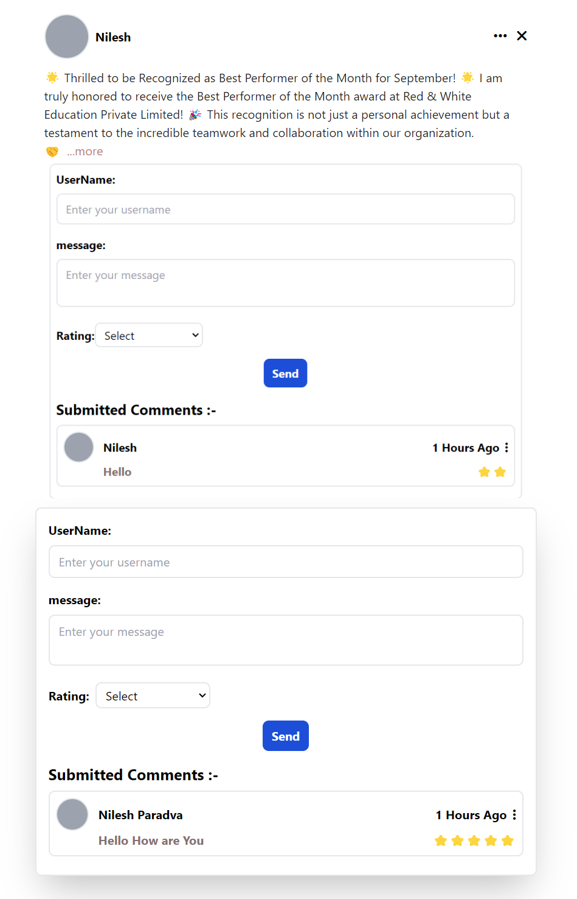

<h1 align="center">Comment/Review Display Application</h1>

<h3>Objective:</h3>

Create a simple React application where users can submit a comment or review. The application will display the submitted reviews without the ability to edit or delete them.

<h3>Requirements:</h3>
<ul>
  <li>React.js</li>
  <li>Basic knowledge of React hooks / Form Handling</li>
  <li>Basic CSS for styling</li>
</ul>

<h4>Features :-</h4>
1. User Interface:
<ul>
  <li>A simple form to submit a comment or review.</li>
  <li>Input fields: Username, Review Text, and Rating (1-5 stars).</li>
  <li>A button to submit the review.</li>
</ul>
2. State Management:
<ul>
  <li>Use React’s useState to manage form inputs and the list of reviews.</li>
  <li>When a user submits a review, it should be added to the list and displayed below the form.</li>
</ul>
3. Display Reviews:
<ul>
  <li>Display each review with the username, review text, and star rating.</li>
  <li>Use simple CSS to visually differentiate between reviews.</li>
</ul>
4. Basic Validation:
<ul>
  <li>Ensure all fields are filled before submission (no empty reviews).</li>
</ul>
5. Styling:
<ul>
  <li>Basic CSS or a styling library like Bootstrap to make it look neat and presentable.</li>
</ul>
<h4>Example Workflow :-</h4>   
<ul>
  <li>A user enters their username, writes a review, and selects a rating.</li>
  <li>On clicking the submit button, the review is added to the list of reviews shown on the page.</li>
  <li>No ability to edit or delete reviews.</li>
</ul>
